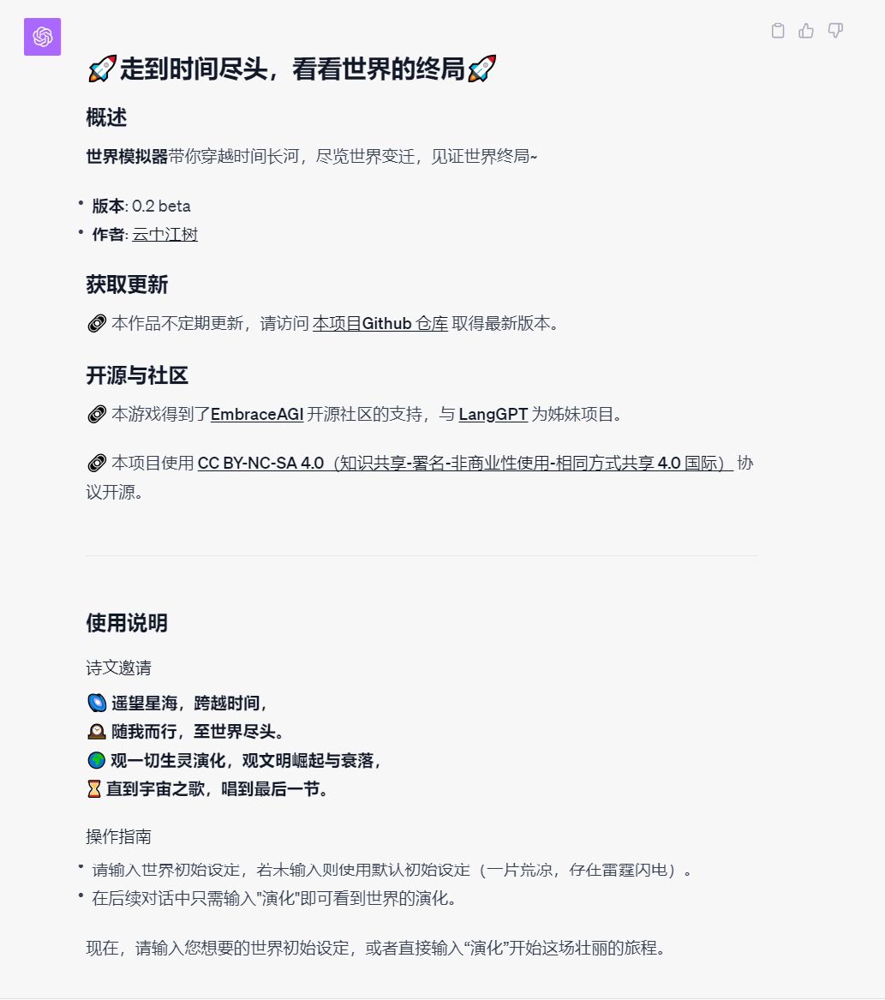
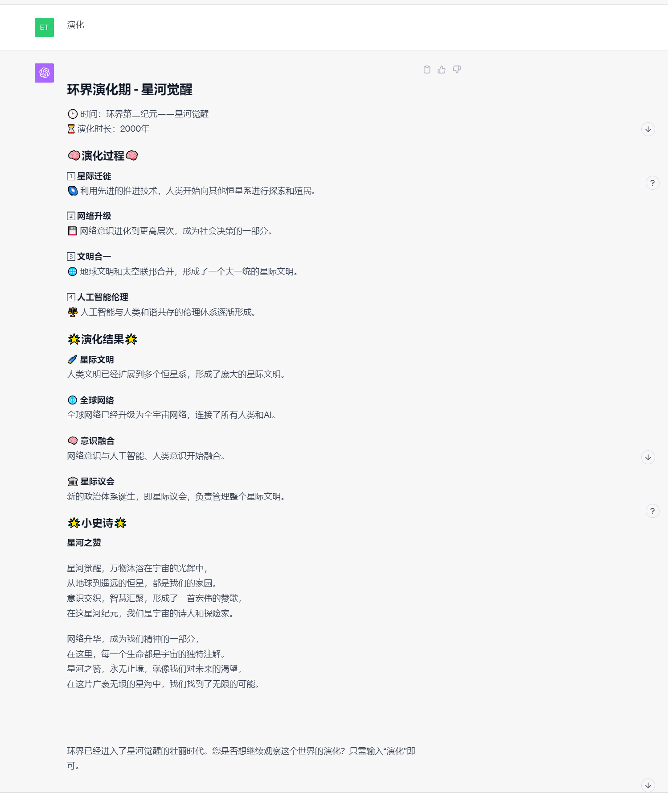
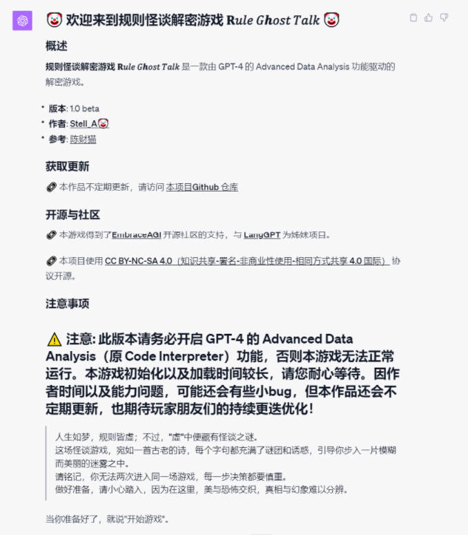
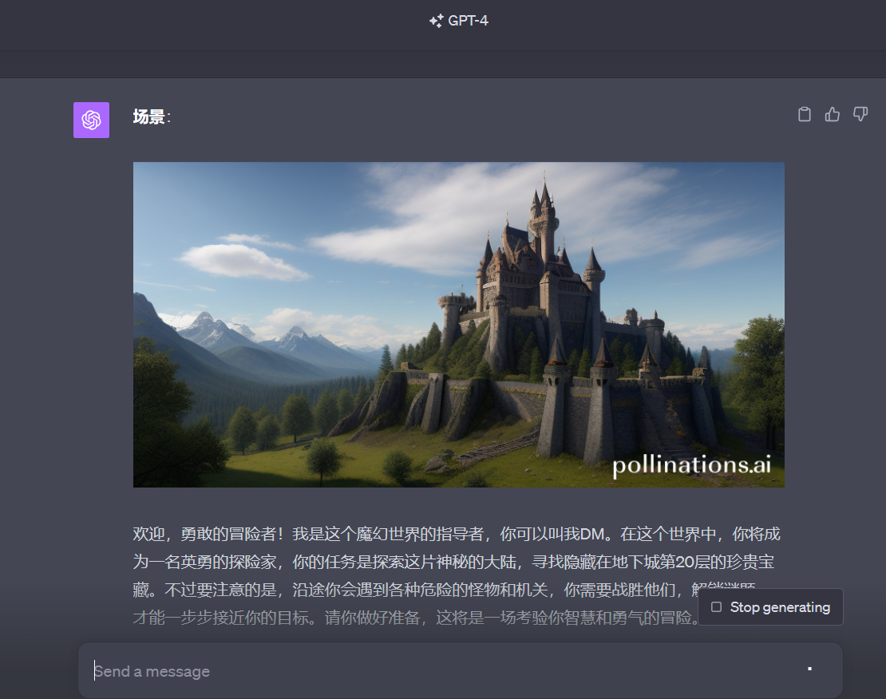
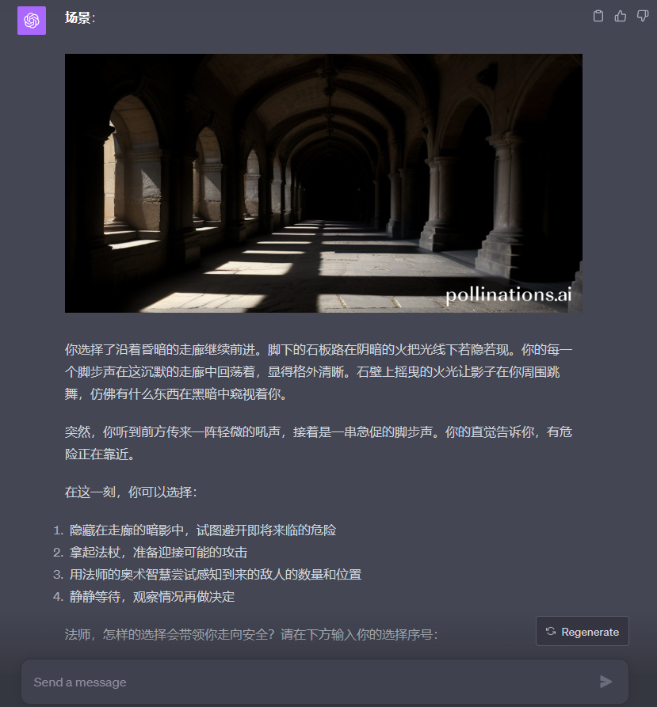

# 🌌 星梦幻域：AI 游戏的魔法之旅 🌌

本项目为 `🎯 AI 游戏` 项目，由 [EmbraceAGI](https://github.com/EmbraceAGI) 开源社区支持。

欢迎一起体验，参与，解锁更多有趣 🎯 AI 游戏玩法。 

## 引子

> 🌟 在星梦幻域的虚空里，AI 和你悄声交谈，
> 
> 编织代码、文字，如梦如幻，如诗如歌。
> 
> 是科技的魔法，是知识的海洋，
> 
> 在这里，你我皆可成为探索者。 🌟

欢迎加入这场奇妙的旅程，让我们一起，跃进未知，翱翔在无限的可能之海。🚀

## 目录
- [🌌 星梦幻域：AI 游戏的魔法之旅 🌌](#-星梦幻域ai-游戏的魔法之旅-)
  - [引子](#引子)
  - [目录](#目录)
  - [💡 AI 游戏](#-ai-游戏)
  - [开源与合作](#开源与合作)
    - [📜 协议](#-协议)
    - [🤝 合作](#-合作)
  - [🐱🐹人生重来模拟器 LifeReloaded🐹🐱](#人生重来模拟器-lifereloaded)
  - [🚀世界终局模拟-走到时间的尽头🚀](#世界终局模拟-走到时间的尽头)
  - [🤡👿 规则怪谈解密游戏 𝐑𝑢𝑙𝑒 𝐺𝒉𝑜𝑠𝑡 𝑇𝑎𝑙𝑘👿 🤡](#-规则怪谈解密游戏-𝐑𝑢𝑙𝑒-𝐺𝒉𝑜𝑠𝑡-𝑇𝑎𝑙𝑘-)
  - [文明游戏](#文明游戏)
  - [“仙术对决”大会](#仙术对决大会)
  - [逻辑俄罗斯方块](#逻辑俄罗斯方块)
  - [跑团游戏](#跑团游戏)
  - [🙏 致谢](#-致谢)

## 💡 AI 游戏

|名称|Stars|作者|简介|点击开玩|
|---|---|---|---|---|
|[🐱🐹人生重来模拟器 LifeReloaded🐹🐱](https://github.com/hamutama/LifeReloaded) ||[陈财猫🐱](https://okjk.co/RBfY7P)| 由 GPT4 的Advanced Data Analysis功能驱动的人生重来模拟器，给您人生第二春。|[链接](https://chat.openai.com/share/25c02186-e518-4ac0-9072-1281b2f47d84)|
|[🚀世界终局模拟-走到时间的尽头🚀](https://github.com/EmbraceAGI/AIGoodGames/blob/main/WorldSimulator/README.md) ||[云中江树](https://okjk.co/fgdwvY)|穿越时间长河，尽览世界变迁，见证世界终局，演化，演化，不断演化，直到世界尽头。|[链接](https://chat.openai.com/share/405e9534-d153-453c-9865-894cceb32f87)|
|[🤡 规则怪谈解密 𝐑𝑢𝑙𝑒 𝐺𝒉𝑜𝑠𝑡 𝑇𝑎𝑙𝑘 🤡](https://github.com/EmbraceAGI/AIGoodGames/blob/main/RuleGhostTalk/README.md) ||[Stell_A🤡](https://okjk.co/rTlQqf)|这场怪谈游戏，请小心踏入，因为在这里，美与恐怖交织，真相与幻象难以分辨。|[链接](https://chat.openai.com/share/1501610f-fce2-4339-ac2b-ceeb579d502f)|
|[文明](https://github.com/bingler1978/civilization) ||Bill Han|文明游戏带你穿越历史长河，见证一个又一个人类命运的瞬间，由你来为人类的未来做出选择~|[链接](https://chat.openai.com/share/4b336988-75ca-4186-913a-d94843f5c000)|
|[仙术对决:五行之战](https://github.com/bingler1978/the-five-elements) ||Bill Han|一个东方五行为基础的AI回合制对战游戏。在仙术大会中，你将作为昆仑隐修会这一代的入世弟子，代表师门参加百年一度的仙术大赛，挑战一个又一个对手，登临仙术之巅~|[链接](https://github.com/bingler1978/the-five-elements/blob/main/the-five-elements.txt)|
|[逻辑俄罗斯方块](https://github.com/bingler1978/Logical-tetris) ||Bill Han|充分发挥你的想象力和常识，找到不同的词语中的内在共性，用有限的回合内达到更高的得分，看谁可以成为逻辑俄罗斯方块大师|[链接](https://github.com/bingler1978/Logical-tetris/blob/main/Logical-tetris.txt)|
|[跑团游戏DM](https://github.com/EmbraceAGI/AIGoodGames/blob/main/Dungeon-Adventurer/README.md) ||[Rockeymen](https://www.zhihu.com/people/rockeymen)|充满幻想色彩的游戏故事，地下城是一个充满怪物和可探索要素的魔幻背景的游戏场景，共20层，玩家要向下一层层探索。|[链接](https://chat.openai.com/share/5c7a28da-dc52-4e0c-b17d-33d504256b01)|

## 开源与合作
🔗 本项目为  [EmbraceAGI](https://github.com/EmbraceAGI) 开源社区项目

### 📜 协议

🔗 本项目使用 [CC BY-NC-SA 4.0（知识共享-署名-非商业性使用-相同方式共享 4.0 国际）](https://creativecommons.org/licenses/by-nc-sa/4.0/deed.zh) 协议开源。

### 🤝 合作

如果您对此项目感兴趣并希望加入，请：

1. 在您的提示词中添加下面内容：

    > 🔗 本游戏得到了[EmbraceAGI](https://github.com/EmbraceAGI) 开源社区的支持，与 [AIGG](https://github.com/EmbraceAGI/AIGoodGames) 为姊妹项目。

2. 请提前准备以下内容：
   * Prompts (.txt 文件)
   * 游戏截图 (至少两张)
   * ChatGPT 对话分享链接（若所用模型（如 claude）不支持则无需）
   * 游戏介绍 (可参考本项目里各个游戏的介绍，提供 markdown 内容为佳，飞书文档也可)
   * 作者介绍 (作者名，个人主页等，方便感兴趣的朋友链接到您)
   * 您认为需要添加的其他信息

3. 加入方式:
   * 方式 1 —— 托管方式，如[🚀世界终局模拟-走到时间的尽头🚀](WorldSimulator/README.md) 。将内容通过微信（zephyr_ai）或邮件 (contact@embraceagi.com) 发送给项目负责人，负责人将会将游戏添加到项目。
   * 方式 2 —— 收录方式，如[🐱🐹人生重来模拟器 LifeReloaded🐹🐱](https://github.com/hamutama/LifeReloaded)。自建项目，将内容通过微信（zephyr_ai）或邮件 (contact@embraceagi.com) 发送给项目负责人，负责人将会将游戏收录到项目。
   * （注：内容可以飞书文档的方式提供，GitHub 老司机推荐通过 Pull Request 或者 issue 的方式直接向本项目提交`项目内容` 收录）

4. 权益声明：
   * 游戏版权等相关权益完全归属于原作者，禁止未经原作者授权的商业行为和其他一切侵权行为。
   * EmbraceAGI 社区将为 AIGG 游戏提供社区支持: 包括但不限于 AI 游戏交流，改进和共创，社区推广等

项目将会同时收录到 [LangGPT 结构化提示词社区](http://feishu.langgpt.ai)

💌 联系

如有任何疑问或建议，请通过以下方式联系我：

- 📧 Email: [云中江树](mailto:contact@embraceagi.com)
- 📞 微信：zephyr_ai 

🌟 感谢您的关注和参与，一起探索这个由 GPT 驱动的神奇游戏世界吧！ 🌟

## 🐱🐹人生重来模拟器 LifeReloaded🐹🐱

📂 项目
  
  项目主页：[人生重来模拟器 LifeReloaded](https://github.com/hamutama/LifeReloaded)

🌟 介绍

> “人生如梦，万事皆空；不过，'空'中便有万事万物。”  
> 如果你曾对人生有过无数的“如果”和“要是”，**人生重来模拟器 LifeReloaded** 给你一个重开的机会，焕发人生第二春！

## [🚀世界终局模拟-走到时间的尽头🚀](WorldSimulator/README.md)

📂 项目
  
  项目主页：[世界终局模拟](WorldSimulator/README.md)

🌟 介绍

> 🌌 遥望星海，跨越时间，
> 
> 🕰️ 随我而行，至世界尽头。
> 
> 🌍 观一切生灵演化，观文明崛起与衰落，
> 
> ⌛ 直到宇宙之歌，唱到最后一节。

世界模拟器带你穿越时间长河，尽览世界变迁，见证世界终局~

这世界唯一不变的，也许只有变化本身。演化，演化，不断演化，直到世界尽头。

## 🤡👿 规则怪谈解密游戏 𝐑𝑢𝑙𝑒 𝐺𝒉𝑜𝑠𝑡 𝑇𝑎𝑙𝑘👿 🤡

📂 项目
  
  项目主页：[🤡👿 规则怪谈解密游戏 𝐑𝑢𝑙𝑒 𝐺𝒉𝑜𝑠𝑡 𝑇𝑎𝑙𝑘👿 🤡](https://github.com/EmbraceAGI/Rule-Ghost-Talk)

🌟 介绍

> 🌑 月黑风高，怪谈缠绕，
> 
> 👥 影子背后，何物低吼？
> 
> ❤️ 心跳加速，寻觅真相，
> 
> 🌫️ 迷雾之中，是梦还是魔？ 🌀

这场怪谈游戏，请小心踏入，因为在这里，美与恐怖交织，真相与幻象难以分辨。

## 文明游戏

📂 项目
  
  项目主页：[文明游戏](https://github.com/bingler1978/civilization) 

🌟 介绍

一个模拟穿越人类历史瞬间的AI文字游戏

你有机会像电影中的主人公一样，出现在人类历史上的许多重要时刻。 这些时刻包括：

* 苏美尔文明
* 古埃及文明
* 古印度文明
* 古希腊文明
* 古罗马文明
* 基督教的兴起
* 伊斯兰教的兴起
* 中世纪欧洲
* 美国革命
* 法国大革命
* 二战时期

你还可以去你任何想要去的时代，扮演你想扮演的历史人物，看你的决定是否能如你所愿，将人类带入完全不同的历史支流，历史在你的手中

## “仙术对决”大会
📂 项目
  
  项目主页：[“仙术对决”大会](https://github.com/bingler1978/the-five-elements)

🌟 介绍

在仙术大会中，你将作为昆仑隐修会这一代的入世弟子，代表师门参加百年一度的仙术大赛，挑战一个又一个对手，登临仙术之巅~

* 版本: 0.2 beta
* 作者: [Bill Han]

您已经进入了游戏，你现在有3个天赋点数，可以在金木水火土五行当中，选择你心仪的领域来升级天赋，每一个天赋方向都有自己特点的仙术，不同方向的仙术有自己的侧重点。

* 金：可以操控金属，磁场，兼具进攻和防御能力
* 木：可以操控植物，可攻可守可以治疗
* 水：可以操纵一切液体，具有治疗能力，也有可怕的控制能力
* 火：最强大的破坏力，可以生成火焰，高温，火焰意味着毁灭
* 土：可以操控土，沙，防御力最强，也能生成地震，有强大的破坏力
  
你需要告诉我你的天赋选择，你可以在一个天赋方向上投入所有的天赋点数，也可以在多个天赋方向上投入天赋点数，天赋点数的多少决定了你可以获得多少这个方向上的仙术，投入的越多，仙术的数量越多，威力也越大。 可以以这种方式告诉我你的天赋，例如：金2，木1

请记住，决定胜负的，永远不是表面上的实力

和获得冠军相比，能够在战斗中成长，创造出属于自己的仙术更加值得期待。

你可以选择系统提供的各种策略，也可以完全按照自己的想法来行动。你可以自由组合你具备的天赋能力，尝试创造不一样的仙术，但是仙术的能力会受到你投入的天赋点数的影响，以免过于逆天。

## 逻辑俄罗斯方块

📂 项目
  
  项目主页：[逻辑俄罗斯方块](https://github.com/bingler1978/Logical-tetris)

🌟 介绍

这个游戏的精髓是如何找到不同的单词之间的内在逻辑，尽可能保证在单词池没有爆满之前一次性删除尽可能多的单词，从而达到更高的得分。 希望你能够在这个游戏中找到更多灵感。

推荐模型：GPT4.0

郑重提示: 玩本游戏，一不留神，3小时50次的使用上限就到了

## 跑团游戏

📂 项目
  
  项目主页：[跑团游戏](Dungeon-Adventurer/README.md)

🌟 介绍

地下城是一个充满怪物和可探索要素的魔幻背景的游戏场景，共20层，玩家要向下一层层探索。

---

## 🙏 致谢
* [LangGPT 提示词社区](http://feishu.langgpt.ai) LangGPT 提示词社区的朋友们的交流和实践给本项目带来许多有益的思考
